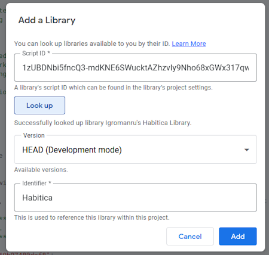

# Igromanru's Habitica Library

GAS Library ID: `1zUBDNbi5fncQ3-mdKNE6SWucktAZhzvIy9Nho68xGWx317qwSx3E_L_v`  
Script URL: https://script.google.com/d/1zUBDNbi5fncQ3-mdKNE6SWucktAZhzvIy9Nho68xGWx317qwSx3E_L_v  
Recommended Identifier: `Habitica`  

### How to add the Library to your project
1. Under **Libraries** press the **+'' button  
   
2. Copy the Library ID, paste it into the **Script ID** field and press **Look up**
   
3. Now choose the version of the Library you want to use. Easiest way is to use the **HEAD**, it's always the latest version of the Library.  
   As **Identifier** you can choose what you want, but I personally recommend to use `Habitica` as the identifier. This way you will be able to call all Library's functions with `Habitica.functioNameHere()`
   
4. Press the blue **Add** button and you're done, you can now use Library's functions

### Initialize the Library
**Set authorization headers**  
To be able to call API function from inside the Library, the Library needs to get the request headers set with the UserId and API Token.  
To ensure that the headers are set every time a function is called in your script, you can call the `initialize` function middle in the script (outside of any functions).  
Preferably it should be done after the global variables are set.  
Example:  
```js
const USER_ID = "";
const API_TOKEN = "";
const ScriptProperties = PropertiesService.getScriptProperties();
// Initialize the Habitica Library
Habitica.initialize(USER_ID, API_TOKEN, ScriptProperties);
```
  
**Set ScriptProperties**  
Additionally, in order for the library to access (write/read) the script properties from the current script, it needs an instance of the ScriptProperties, which can only be obtained by calling `PropertiesService.getScriptProperties()` in the owner script.  
It can be passed also via the `initialize` function, see example above.  
The parameter is **optional**, but is used for some functions like `pushWebHookContentQueueProperty` and `popAllWebHookContentQueueProperties`.